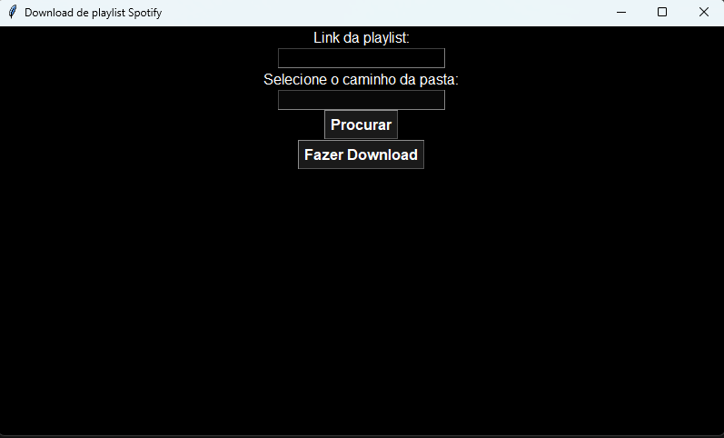

# SpotifyDownload



## Visão Geral
`SpotifyDownload.py` é um projeto em Python desenvolvido para baixar faixas de áudio de uma playlist do Spotify. Ele utiliza a API do Spotify para recuperar playlists e o YouTube para baixar os arquivos de áudio, oferecendo uma solução simples. O projeto inclui uma interface gráfica amigável usando Tkinter, facilitando o uso.

## Funcionalidades
- **Integração com a API do Spotify**: Autenticação e conexão à API do Spotify para recuperação das faixas da playlist.
- **Busca e Download no YouTube**: Extrai nomes de faixas e busca por elas no YouTube para download dos arquivos de áudio.
- **Conversão de Áudio**: Converte os áudios baixados para o formato MP3, se necessário.
- **Interface Gráfica**: Interface amigável para fácil interação.
- **Gerenciamento de Arquivos**: Remove arquivos temporários e lida com exceções durante o download.

## Requisitos
- Python 3.x
- spotipy
- yt_dlp
- youtubesearchpython
- tkinter
- ffmpeg

## Instalação
1. **Instalar Python**: Verifique se você possui o Python 3.x instalado no seu sistema. Caso não tenha, baixe e instale a partir do [python.org](https://www.python.org/).
2. **Clonar o Repositório**:
    ```bash
    git clone https://github.com/Arthur020104/DownloadFromSpotify.git
    ```
3. **Atualizar Credenciais**:
   Substitua `CLIENT_ID` e `CLIENT_SECRET` na função `DownloadFromPlaylist` no arquivo `SpotifyDownload.py` com suas credenciais da API do Spotify. Obtenha essas credenciais no [Spotify Developer Dashboard](https://developer.spotify.com/dashboard).
4. **Instalar Dependências**:
    ```bash
    pip install -r requirements.txt
    ```
5. **Instalar ffmpeg**:
    - Baixe e instale o ffmpeg de [ffmpeg.org](https://ffmpeg.org/download.html).

## Uso
### Interface Gráfica (GUI)
1. **Executar a GUI**:
    ```bash
    python UserInterface.py
    ```
2. **Usar a GUI**:
    - Insira o URL da playlist do Spotify no campo de texto designado.
    - Selecione a pasta de destino para salvar os arquivos de áudio utilizando o botão "Procurar" ou insira o caminho manualmente.
    - Clique no botão "Fazer Download" para iniciar o processo de download.
